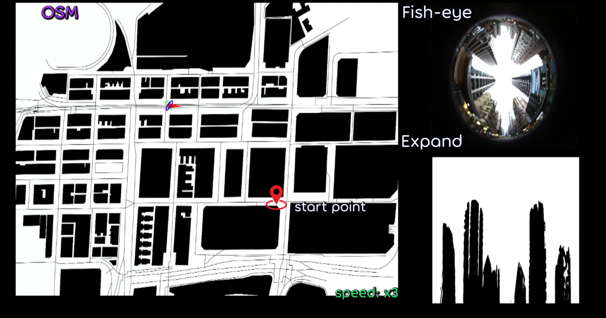

# SkyLoc
The implementation of SkyLoc.  
The code and dataset will be open-sourced upon acceptance of the paper.  
The accompanied video can be found at: https://youtu.be/cb6afp_Q_GA  

<a href="https://youtu.be/cb6afp_Q_GA">
 

# Something about Triplet-Graph
## What is SkyLoc 
SkyLoc is a 3-DoF Global Localization method based on a sky-looking fish-eye camera with the publicly available OpenStreetMap(OSM), aiming to achieve real-time metric localization in dynamic traffic environments.
